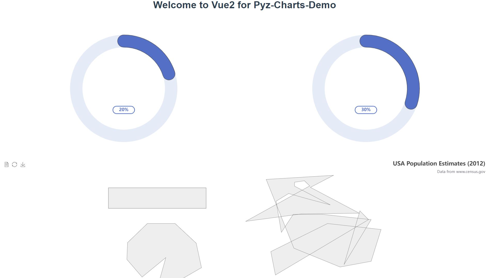

# pyz-charts-demo

## Project setup
```
npm install
```

### Compiles and hot-reloads for development
```
npm run serve
```

### Compiles and minifies for production
```
npm run build
```

### Lints and fixes files
```
npm run lint
```

### Customize configuration
See [Configuration Reference](https://cli.vuejs.org/config/).

>  Vue.js 2.6

## Pyz-Charts
- pyz-charts will stay with Vue 2.x

## Install
```shell
npm install pyz-charts
```
``` xsdregexp
version: 1.0.6+
1、解决了resize冲突问题，加入句柄对象
2、解决了Vue动态绑定渲染层!DOCTYPE标准的高度不能加载的问题
3、释放句柄对象、提升性能
4、依赖echarts所以项目文件不用在npm i echarts这个过程，
防止main.js导入过多依赖影响首次加载性能。
```
### Vue import use

```js
// main.js 
import Vue from 'vue';
import PyzCharts from "pyz-charts";

Vue.use(PyzCharts)
```
## Quick Start
``` vue
<!-- a.template -->
<template>
  <pyz-charts @init="callbackEchartsInstance" :option="youEhartsOption"/>
</template>
```
- 1、封装了所有的echarts事件,支持所有事件@click等
- 2、@init事件回调（instance）实例，可以做深度检测,和扩展。
- 3、option绑定v-bind是echarts的option配置文件，可以写成Option类的实例
- 例如:
``` vue
<!-- a.template -->
<template>
  <pyz-charts @click="clickMethod" 
  @mousemove="mousemoveMethod" 
  @mouseover="mouseoverMethod" 
  @keydown="keydownMethod" 
  @keyup="keyupMethod" 
  ...
  :option="youEhartsOption"/>
</template>

```
#### Option建议写法
``` ts
  'use strict'
  class CarOption {
      public option: any;
      constructor(props){
         this.option = {};
      }
  }
```

``` vue
<script>
// a.vue
  export default {
      ...
     methods: {
         callbackEchartsInstance(ecInstance) {
            ?ecInstance.setOption(option)
            or
            ?ecInstance?....
         }
     }
  }
</script>
```


## Browser Support
- 支持Vue
- ES6 module


## Development
- Vue Cli

## 作者
- 彭一真
## LICENSE
[MIT](LICENSE)
